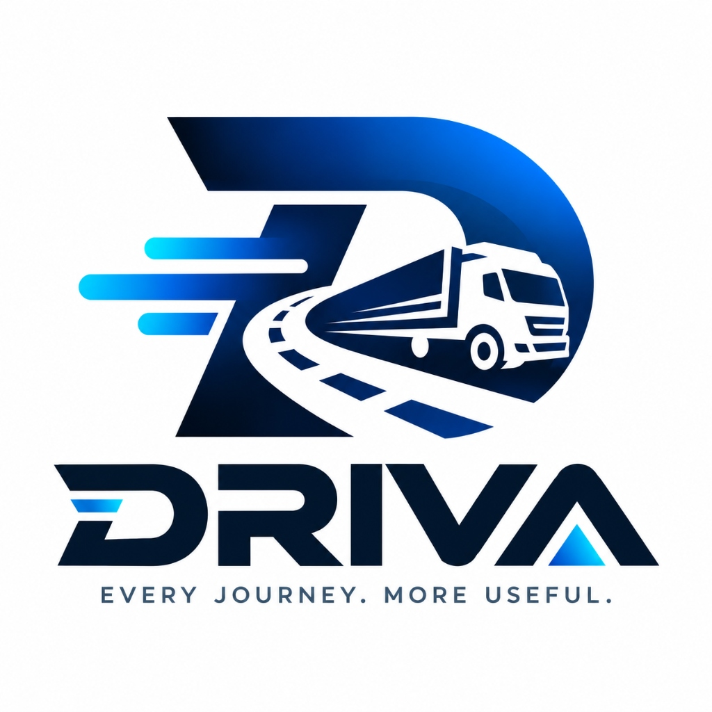

<div align="center">



# DRIVA
### Dynamic Routing, Intelligence & Vehicle Allocation
**Enterprise B2B Transportation Procurement & Decision Intelligence Platform**

*"Every Journey. More Useful."*

[](https://python.org)
[](https://fastapi.tiangolo.com)
[](https://react.dev/)
[](https://www.typescriptlang.org/)
[](https://vitejs.dev/)
[](https://scikit-learn.org/)
[](https://tailwindcss.com/)
[](https://groq.com/)
[](#14-license--production-disclaimer)

</div>

---

## Table of Contents

- [1. Executive Summary & Problem Statement](#1-executive-summary--problem-statement)
- [2. System Architecture & End-to-End Pipeline](#2-system-architecture--end-to-end-pipeline)
- [3. Platform Modules & Key Capabilities](#3-platform-modules--key-capabilities)
  - [3.1 4-Step Procurement Request Flow](#31-4-step-procurement-request-flow)
  - [3.2 Hard Physical Constraint Pre-Filtering](#32-hard-physical-constraint-pre-filtering)
  - [3.3 Triple ML Inference Pipeline](#33-triple-ml-inference-pipeline)
  - [3.4 DRIVA 7-Factor Weighted Decision Engine](#34-driva-7-factor-weighted-decision-engine)
  - [3.5 Smart Match Recommendation Hub & Visualizations](#35-smart-match-recommendation-hub--visualizations)
  - [3.6 Deep-Dive Candidate Fit Modal (4 Audit Tabs)](#36-deep-dive-candidate-fit-modal-4-audit-tabs)
  - [3.7 Groq LLaMA 3.3 70B AI Decision Reasoning](#37-groq-llama-33-70b-ai-decision-reasoning)
  - [3.8 1-Click Dispatch & 5% DRIVA Service Fee Model](#38-1-click-dispatch--5-driva-service-fee-model)
  - [3.9 Live GPS Telemetry & OpenStreetMap Route Tracking](#39-live-gps-telemetry--openstreetmap-route-tracking)
  - [3.10 Multi-Role Portal Experiences](#310-multi-role-portal-experiences)
  - [3.11 8-Module Enterprise Settings Suite](#311-8-module-enterprise-settings-suite)
  - [3.12 Conversational Decision Assistant (AI Copilot)](#312-conversational-decision-assistant-ai-copilot)
- [4. Technology Stack & Design System](#4-technology-stack--design-system)
- [5. Supported Freight Corridors & Fleet Specifications](#5-supported-freight-corridors--fleet-specifications)
- [6. How to Run the Project](#6-how-to-run-the-project)
  - [6.1 System Prerequisites](#61-system-prerequisites)
  - [6.2 Quick Start (One-Click Launch Scripts)](#62-quick-start-one-click-launch-scripts)
  - [6.3 Step-by-Step Manual Installation](#63-step-by-step-manual-installation)
  - [6.4 Machine Learning Dataset Generation & Training](#64-machine-learning-dataset-generation--training)
  - [6.5 Environment Configuration (.env)](#65-environment-configuration-env)
- [7. Demo Accounts & Access Credentials](#7-demo-accounts--access-credentials)
- [8. End-to-End Verification Walkthrough (Salem → Bangalore)](#8-end-to-end-verification-walkthrough-salem--bangalore)
- [9. Automated Testing & Verification Suite](#9-automated-testing--verification-suite)
- [10. Complete REST API Specifications](#10-complete-rest-api-specifications)
- [11. Project Directory Structure](#11-project-directory-structure)
- [12. Troubleshooting & FAQ](#12-troubleshooting--faq)
- [13. Brand Identity & Logo Guidelines](#13-brand-identity--logo-guidelines)
- [14. License & Production Disclaimer](#14-license--production-disclaimer)

---

## 1. Executive Summary & Problem Statement

In the traditional freight and logistics ecosystem—particularly across emerging and high-growth industrial corridors—transportation procurement remains largely manual, fragmented, and inefficient:
* **Manual Brokering Friction**: Shippers rely on phone calls, WhatsApp groups, and unstructured brokers to source trucks, resulting in delays of 6 to 24 hours just to confirm vehicle availability.
* **Opaque & Arbitrary Pricing**: Rates fluctuate wildly based on ad-hoc broker markups rather than scientific market telemetry, distance, road congestion, or fuel costs.
* **Vehicle Mismatches & Safety Violations**: Shippers frequently receive vehicles that cannot physically accommodate their cargo dimensions ($L \times W \times H$) or exceed axle weight ratings.
* **Empty Deadhead Miles**: Trucks return empty up to 40% of the time due to lack of coordinated matching, driving up costs and carbon emissions.

### The DRIVA Solution

**DRIVA does not own physical trucks. DRIVA is the intelligent software infrastructure layer** that bridges corporate shippers, fleet owners, logistics agencies, and commercial drivers into an automated, mathematically optimized transportation procurement marketplace.

```
       CORPORATE SHIPPERS                           FLEET & LOGISTICS PROVIDERS
  [Manufacturing, Wholesale, Retail]               [Fleet Owners, Agencies, Drivers]
                 │                                                │
                 ▼                                                ▼
     ┌──────────────────────────────────────────────────────────────────┐
     │                             DRIVA                                │
     │       Dynamic Routing, Intelligence & Vehicle Allocation         │
     │                                                                  │
     │  1. Hard Physical Chassis Filtering (Payload & Dimensions)       │
     │  2. Triple ML Predictive Inference (Cost, ETA, Suitability)      │
     │  3. 7-Factor Weighted Decision Scoring (100% Normalized)         │
     │  4. Recharts Decision Analytics & Groq AI Reasoning              │
     │  5. 1-Click Dispatch with Transparent 5% DRIVA Service Fee       │
     │  6. Live GPS Telemetry Simulation along Industrial Corridors     │
     └──────────────────────────────────────────────────────────────────┘
```

---

## 2. System Architecture & End-to-End Pipeline

DRIVA connects shippers and transport providers through an end-to-end pipeline:

```
┌────────────────────────────────────────────────────────────────────────────────────────┐
│ 1. CREATION LAYER (Business Shipper)                                                   │
│    • Origin & Destination Corridor (e.g., Salem → Bangalore, 340 km)                   │
│    • Cargo Physical Attributes: Weight (kg), Dimensions (L × W × H in m), Volume (m³)  │
│    • Delivery Constraints: Required Deadline (hours), Priority (URGENT/HIGH/NORMAL)    │
└──────────────────────────────────────────┬─────────────────────────────────────────────┘
                                           │
                                           ▼
┌────────────────────────────────────────────────────────────────────────────────────────┐
│ 2. DATABASE CANDIDATE RETRIEVAL & HARD CONSTRAINTS FILTERING                           │
│    • Query active carriers and registered vehicles within origin corridor radius        │
│    • HARD CONSTRAINT 1: Cargo Weight ≤ Usable Vehicle Payload Capacity (kg)            │
│    • HARD CONSTRAINT 2: Cargo Envelope ≤ Usable Internal Chassis Clearance (L, W, H)   │
│    • HARD CONSTRAINT 3: Route Viability & Radius Feasibility                           │
│    ── Rejected vehicles are recorded with explicit physical failure reasons ──         │
└──────────────────────────────────────────┬─────────────────────────────────────────────┘
                                           │ (Qualified Vehicles)
                                           ▼
┌────────────────────────────────────────────────────────────────────────────────────────┐
│ 3. TRIPLE MACHINE LEARNING INFERENCE LAYER                                             │
│    • Cost Model (GradientBoostingRegressor, R² > 0.98):                                │
│        Predicts fair-market freight cost considering distance, fuel, traffic, weight  │
│    • ETA Model (GradientBoostingRegressor, R² > 0.95):                                 │
│        Predicts transit time in hours accounting for highway speed & congestion        │
│    • Suitability Model (RandomForestClassifier, Acc > 94%):                            │
│        Evaluates powertrain compatibility, vehicle age, driver rating & weather        │
└──────────────────────────────────────────┬─────────────────────────────────────────────┘
                                           │
                                           ▼
┌────────────────────────────────────────────────────────────────────────────────────────┐
│ 4. DRIVA 7-FACTOR WEIGHTED DECISION ENGINE (100% Normalized Score)                     │
│    • 25% Route Compatibility Score   • 20% Cost Efficiency Score                       │
│    • 20% ETA & Deadline Compliance   • 15% Payload Capacity Utilization                │
│    • 10% Vehicle Suitability Model   •  5% Carrier Reliability Rating                  │
│    •  5% Vehicle Instant Availability                                                  │
└──────────────────────────────────────────┬─────────────────────────────────────────────┘
                                           │
                                           ▼
┌────────────────────────────────────────────────────────────────────────────────────────┐
│ 5. SMART MATCH DECISION HUB & VISUALIZATION                                            │
│    • 🏆 Recommended Carrier Hero Card with 4-KPI Overview                              │
│    • 7-Factor Weighted Progress Bar Breakdown                                          │
│    • Recharts Decision Charts (Cost vs ETA Scatter, Cost Compare, ETA, Match Score)    │
│    • Ranked Candidates Comparison Table                                                │
│    • Deep-Dive 4-Quadrant Fit Modal (Chassis Dimensions, Telemetry, Breakdown)         │
│    • Groq LLaMA 3.3 70B Natural Language Decision Reasoning                            │
└──────────────────────────────────────────┬─────────────────────────────────────────────┘
                                           │
                                           ▼
┌────────────────────────────────────────────────────────────────────────────────────────┐
│ 6. 1-CLICK DISPATCH & FINANCIAL SETTLEMENT                                             │
│    • Instant Consignment Booking & Digital Waybill Creation                            │
│    • Transparent 5% DRIVA Platform Service Fee applied (zero hidden broker markup)     │
│    • Carrier Dispatched with Live OpenStreetMap GPS Route Simulation                   │
└────────────────────────────────────────────────────────────────────────────────────────┘
```

---

## 3. Platform Modules & Key Capabilities

### 3.1 4-Step Procurement Request Flow
The Shipper procurement wizard is structured to capture all required logistics parameters without cognitive overload:
1. **Route & Corridor**: Origin city, destination city, computed highway distance, pickup date and time.
2. **Cargo Specifications**: Cargo classification (Electronics, Industrial Goods, FMCG, Perishable, Hazardous, Bulk Material), exact weight in kg, physical dimensions (Length, Width, Height in meters), and computed cargo volume in $\text{m}^3$.
3. **Vehicle & Priority**: Delivery urgency (`URGENT`, `HIGH`, `NORMAL`, `LOW`), deadline horizon (Within 4h, 8h, 24h, 48h), vehicle preference (`Any`, `Tata Ace`, `Bolero Pickup`, `EV Cargo Van`, `Mini Truck`, `Medium Truck`, `Heavy Truck`), special requirements (Temperature Control, Waterproof Tarpaulin, Tail Lift).
4. **Review & Dispatch**: Real-time summary card verifying all dimensions and constraints before executing the matching engine.

### 3.2 Hard Physical Constraint Pre-Filtering
Before evaluating candidates with ML models, DRIVA executes hard constraint checks:
* **Payload Verification**:
  $$\text{Cargo Weight (kg)} \le \text{Vehicle Maximum Payload (kg)}$$
* **Dimensional Envelope Clearance**:
  $$\text{Cargo Length} \le \text{Chassis Usable Length} \quad\land\quad \text{Cargo Width} \le \text{Chassis Usable Width} \quad\land\quad \text{Cargo Height} \le \text{Chassis Usable Height}$$
  *Example*: A cargo of dimensions $2.5\text{m} \times 1.5\text{m} \times 1.2\text{m}$ will be **rejected** for a Tata Ace (max cargo length $2.1\text{m}$), preventing physical loading failures at the warehouse dock.

### 3.3 Triple ML Inference Pipeline
DRIVA uses three specialized Scikit-Learn models trained on 22,000 synthesized corridor trips:
* **Cost Prediction Model** (`GradientBoostingRegressor`):
  Predicts fair-market freight cost in INR (₹).
  *Features*: `distance_km`, `cargo_weight_kg`, `cargo_volume_m3`, `fuel_enc`, `vehicle_capacity_kg`, `vehicle_age_years`, `vehicle_efficiency`, `traffic_factor`, `weather_factor`, `priority_enc`, `vehicle_enc`.
  *Performance*: $R^2 \approx 0.98+$, $\text{MAE} \approx \text{₹}180\text{--}220$.
* **ETA Prediction Model** (`GradientBoostingRegressor`):
  Predicts realistic transit duration in hours.
  *Features*: `distance_km`, `cargo_weight_kg`, `traffic_factor`, `weather_factor`, `vehicle_efficiency`, `vehicle_age_years`, `vehicle_enc`, `priority_enc`.
  *Performance*: $R^2 \approx 0.95+$, $\text{MAE} \approx 0.35\text{ hours}$.
* **Vehicle Suitability Model** (`RandomForestClassifier`):
  Predicts likelihood of successful, on-time delivery under current road conditions.
  *Features*: 15 composite telemetry factors including driver experience, historical rating, powertrain, and urgency.
  *Performance*: Accuracy $\approx 94\%+$, F1-Score $\approx 0.93+$.

*Reliability*: If compiled `.pkl` model files are absent, DRIVA automatically applies domain-calibrated deterministic mathematical fallback formulas to guarantee 100% operational uptime.

### 3.4 DRIVA 7-Factor Weighted Decision Engine
Every qualified carrier candidate receives a normalized composite DRIVA Match Score ($0\text{--}100$):

$$\begin{aligned}
\text{DRIVA Match Score} = & \; 0.25 \times \text{Route Compatibility} \\
& + 0.20 \times \text{Cost Efficiency} \\
& + 0.20 \times \text{ETA \& Deadline Compliance} \\
& + 0.15 \times \text{Capacity Utilization} \\
& + 0.10 \times \text{Vehicle Suitability} \\
& + 0.05 \times \text{Carrier Reliability} \\
& + 0.05 \times \text{Vehicle Availability}
\end{aligned}$$

| Factor | Weight | Evaluation Logic |
| :--- | :---: | :--- |
| **Route Compatibility** | **25%** | Proximity to pickup hub, highway corridor alignment, and coverage radius |
| **Cost Efficiency** | **20%** | Normalized cost score comparing predicted carrier rate against corridor baseline |
| **ETA & Deadline** | **20%** | Transit duration compared against shipper deadline; penalizes near-deadline or overdue times |
| **Capacity Utilization** | **15%** | $\frac{\text{Cargo Weight}}{\text{Vehicle Payload}} \times 100$. Optimal fit ($60\%\text{--}90\%$) scores highest |
| **Vehicle Suitability** | **10%** | ML suitability probability factoring powertrain, vehicle age, and weather |
| **Carrier Reliability** | **5%** | Historical SLA completion rate, driver experience years, and corporate rating |
| **Vehicle Availability** | **5%** | Instant dispatch readiness status |

### 3.5 Smart Match Recommendation Hub & Visualizations
The flagship recommendation interface delivers immediate procurement insights:
* **🏆 Recommended Option Hero**: Highlights the optimal choice with carrier name, vehicle model, license plate, predicted cost, transit duration, match score, and 1-click booking CTA.
* **4-Quadrant KPI Grid**:
  * 💰 **Predicted Cost**: With transparent 5% DRIVA Service Fee breakdown.
  * ⏱️ **Transit Time**: In hours, with estimated delivery timestamp.
  * 🎯 **DRIVA Match Score**: Overall fit percentage ($/100$).
  * 📅 **Deadline Status**: Compliance tag (`Met` / `Risk` / `Exceeded`).
* **Interactive Recharts Visualizations**:
  * **Cost vs ETA Trade-Off**: Scatter chart mapping transit duration ($X$-axis, hours) vs cost ($Y$-axis, ₹) with a green highlight on the recommended carrier.
  * **Cost Comparison**: Clean bar chart comparing baseline rates across all candidate carriers.
  * **ETA Comparison**: Bar chart comparing transit hours.
  * **DRIVA Match Score**: Ranked bar chart of composite scores.
* **Multi-Candidate Data Table**: Filterable and sortable registry of all eligible options with "Details" and "Book" actions.

### 3.6 Deep-Dive Candidate Fit Modal (4 Audit Tabs)
Clicking "Details" on any candidate opens an enterprise procurement modal with 4 tabs:
1. **Transport Option**: Carrier name, fleet type, fuel/powertrain, driver name, experience years, driver rating.
2. **Cargo Fit**: Weight utilization bar (e.g., $200\text{ kg} / 800\text{ kg} = 25.0\%$), dimensional check breakdown (Length $\le$ Max, Width $\le$ Max, Height $\le$ Max).
3. **ML Predictions**: Predicted freight cost, predicted transit time, shipper deadline, and deadline compliance indicator.
4. **Decision Factors**: All 7 weighted factors displayed with raw points and weighted contribution towards the final score.

### 3.7 Groq LLaMA 3.3 70B AI Decision Reasoning
Powered by Groq's high-speed inference engine running LLaMA 3.3 70B Versatile:
* DRIVA provides the LLM with structured telemetry (cargo details, recommended carrier specs, second-place carrier specs, cost and ETA deltas).
* The model returns an executive justification explaining why the top carrier was selected over alternatives and highlighting trade-offs.
* If no Groq API key is present, DRIVA generates domain-calibrated deterministic reasoning text automatically.

### 3.8 1-Click Dispatch & 5% DRIVA Service Fee Model
DRIVA uses a transparent **Software Service Fee** structure:
* **Base Freight Cost**: The complete payment due to the carrier/driver.
* **DRIVA Service Fee (5%)**: Software fee for automated allocation, ML models, SLA monitoring, and digital proof-of-delivery archival.
* **Total B2B Invoice**: Base Freight Cost + 5% DRIVA Service Fee.
* *Zero Hidden Fees*: No opaque broker markups or commission terminology.

### 3.9 Live GPS Telemetry & OpenStreetMap Route Tracking
Once booked, consignments transition into the active tracking engine:
* **Interactive Map**: Built with Leaflet and OpenStreetMap.
* **Simulated Route Waypoints**: Realistic coordinate interpolation along actual Indian highways (e.g., Salem $\to$ Dharmapuri $\to$ Krishnagiri $\to$ Hosur $\to$ Bangalore along NH44).
* **Live Telemetry Gauges**: Real-time speed (km/h), distance remaining (km), estimated time of arrival, and driver status.
* **Milestone State Machine**: `BOOKED` $\to$ `DISPATCHED` $\to$ `IN_TRANSIT` $\to$ `OUT_FOR_DELIVERY` $\to$ `DELIVERED`.

### 3.10 Multi-Role Operational Workspaces & Navigation Architecture
Rather than presenting a generic one-size-fits-all dashboard, DRIVA is built on the philosophy of **"One platform, different operational workspaces."** Each user role operates within its own dedicated information architecture, visual panel hierarchy, and purpose-built dashboard view:

```
┌─────────────────────────────────────────────────────────────────────────────────────────────────┐
│                              DRIVA MULTI-ROLE PANEL ARCHITECTURE                                │
├───────────────────────────────┬─────────────────────────────────┬───────────────────────────────┤
│ ROLE & WORKSPACE              │ SIDEBAR GROUPS & NAVIGATION     │ DASHBOARD WORKSPACE FOCUS     │
├───────────────────────────────┼─────────────────────────────────┼───────────────────────────────┤
│ 1. BUSINESS OWNER             │ MAIN                            │ • Active Transport Requests   │
│    (Transportation            │  • Dashboard, New Request,      │ • Recommended Transport Hero  │
│     Procurement Portal)       │    My Requests, Smart Matches,  │ • Upcoming Deliveries Tracker │
│    Badge: "Procurement"       │    Bookings, Active Deliveries, │ • Transportation Spend & Vol  │
│    Quick Action: + New Request│    Tracking                     │ • Estimated Savings (~14%)    │
│                               │ INSIGHTS                        │ • Provider Reliability Index  │
│                               │  • Cost Analytics, History,     │ • Average DRIVA Match Score   │
│                               │    Provider Performance         │                               │
│                               │ TOOLS                           │                               │
│                               │  • AI Assistant, Notifications  │                               │
│                               │ ACCOUNT                         │                               │
│                               │  • Profile, Settings            │                               │
├───────────────────────────────┼─────────────────────────────────┼───────────────────────────────┤
│ 2. FLEET OWNER                │ FLEET                           │ • Total Vehicles (15)         │
│    (Fleet Operations &        │  • Fleet Overview, Vehicles,    │ • Available for Dispatch (9)  │
│     Asset Utilization)        │    Availability, Allocation     │ • Currently In Transit (5)    │
│    Badge: "Fleet Ops"         │ OPERATIONS                      │ • Vehicle Utilization % (73%) │
│    Quick Action: + Register   │  • Transport Requests, Assigned │ • Driver Readiness (12 duty)  │
│                               │    Jobs, Deliveries, Drivers    │ • Monthly Carrier Earnings    │
│                               │ PERFORMANCE                     │ • Vehicle Performance Specs   │
│                               │  • Utilization, Earnings,       │                               │
│                               │    Performance Analytics        │                               │
│                               │ ACCOUNT                         │                               │
│                               │  • Fleet Profile, Settings      │                               │
├───────────────────────────────┼─────────────────────────────────┼───────────────────────────────┤
│ 3. LOGISTICS AGENCY           │ OPERATIONS                      │ • Open Transport Opportunities│
│    (Shipment Operations &     │  • Agency Overview, Requests,   │ • Available Partner Capacity  │
│     Freight Brokerage)        │    Available Capacity, Matches, │ • Pending Consignment Requests│
│    Badge: "Agency Ops"        │    Bookings, Active Shipments   │ • Active Highway Shipments    │
│    Quick Action: Match Loads  │ NETWORK                         │ • Completed Consignments (142)│
│                               │  • Fleet Partners, Drivers,     │ • Brokerage Revenue Ledger    │
│                               │    Corporate Customers          │ • Customer Trust Rating (4.9★)│
│                               │ PERFORMANCE                     │ • On-Time Delivery SLA (98.4%)│
│                               │  • Delivery Performance,        │                               │
│                               │    Revenue, Reliability,        │                               │
│                               │    Analytics                    │                               │
│                               │ ACCOUNT                         │                               │
│                               │  • Agency Profile, Settings     │                               │
├───────────────────────────────┼─────────────────────────────────┼───────────────────────────────┤
│ 4. COMMERCIAL DRIVER          │ TODAY'S MISSION                 │ • Active Mission #BK-8842     │
│    (Mobile-First Delivery     │  • My Jobs, Active Delivery,    │ • Pickup & Drop Locations     │
│     Execution Cockpit)        │    Navigation Route             │ • Shipper/Receiver Contacts   │
│    Badge: "Driver Cockpit"    │ HISTORY & PAY                   │ • Cargo Specs (200kg, 2.5m)   │
│    Status Toggle: On Duty     │  • Completed Jobs, My Earnings  │ • EV Van Battery Status (84%) │
│    Mobile: Bottom Nav Bar     │ ACCOUNT                         │ • Live Delivery State Updater │
│                               │  • Driver Profile, Settings     │ • Today's Payout (₹2,984.24)  │
├───────────────────────────────┼─────────────────────────────────┼───────────────────────────────┤
│ 5. PLATFORM ADMIN             │ PLATFORM                        │ • System Health (99.98% SLA)  │
│    (Executive Administration &│  • Overview, Users, Businesses, │ • Users, Businesses, Providers│
│     Financial Governance)     │    Providers, Fleet, Bookings   │ • Transportation GMV Ledger   │
│    Badge: "Platform Admin"    │ MONITORING & FINANCE            │ • DRIVA Service Fee (5%) Card │
│    Status: 99.98% System SLA  │  • Platform Analytics, Revenue, │ • Average Match Score (91.2)  │
│                               │    DRIVA Service Fee, Health    │ • Carrier Verification Queue  │
│                               │ MANAGEMENT                      │ • Scikit-Learn Model Telemetry│
│                               │  • Verification, Alerts, Reports│                               │
│                               │ ACCOUNT                         │                               │
│                               │  • Admin Profile, Settings      │                               │
└───────────────────────────────┴─────────────────────────────────┴───────────────────────────────┘
```

#### Reusable Sidebar Component Architecture
* **`SidebarShell.tsx`**: Reusable navigation shell providing brand identity (`logo.png`), role badge variants, dynamic operational status indicators, quick action shortcuts, scrollable navigation groups, user profile footer, and slide-over mobile drawer support.
* **Role Sidebars**:
  * `BusinessSidebar.tsx`: Curated for corporate procurement and freight dispatch.
  * `FleetSidebar.tsx`: Curated for vehicle asset management and driver allocation.
  * `AgencySidebar.tsx`: Curated for multi-carrier load brokering and customer accounts.
  * `DriverSidebar.tsx`: Streamlined, mobile-friendly cockpit navigation.
  * `AdminSidebar.tsx`: Comprehensive governance, carrier auditing, and revenue monitoring.
* **`NavigationSidebar.tsx`**: High-performance role dispatcher routing users to their tailored sidebar based on authenticated role.
* **Responsive Layout**:
  * Desktop: Fixed 240px enterprise sidebar.
  * Tablet / Mobile: Top header with hamburger drawer toggle and logo badge.
  * Driver Mobile: Bottom navigation bar for single-thumb mission control.

### 3.11 Dedicated Enterprise Settings Workspace
Settings is not an ordinary sidebar tab; it is an independent **two-column enterprise configuration workspace** with a dedicated navigation panel on the left and role-calibrated configuration panels on the right (`SettingsPanel.tsx`):

* **Left Navigation Panel (`SettingsNavigationPanel`)**:
  * Dynamic role identity header indicating configured role workspace.
  * Role-specific tab selector with active badge indicators, icons, and contextual subtitles.
  * Direct enterprise integration support helpline.
* **Right Panel Content (Role-Tailored)**:
  * **Business Shipper**: Company Profile (GSTIN, PAN, registered warehouse), Procurement Preferences (default priority, units, insurance verification), Delivery Alerts (Email/SMS), Security & 2FA, Billing & 5% DRIVA Service Fee Invoices, Connected ERP Webhooks (SAP/Oracle), Privacy & CSV Audit Export.
  * **Fleet Owner**: Fleet Carrier Profile (Hub location, commercial license), Driver Preferences (auto-assignment, 8-hour shift limits, EV prioritization), Dispatch Alerts, Security & Access, Payout Bank Account & Service Fee Ledger.
  * **Logistics Agency**: Agency Brokerage Profile, Service Preferences (margin rates, 15% reserve buffer, SLA levels), Brokerage Alerts, Team Accounts & Security, Service Fee Reconciliation.
  * **Commercial Driver**: Personal Driver Profile (Commercial Driving License CDL, emergency contacts), Assigned Vehicle Specifications (EV Cargo Van telemetry, battery health 99.2%, maintenance history), Job Alerts, Quick PIN & Password Security.
  * **Platform Administrator**: Platform Settings (corridor search radius 25 km, ML model version 1.0.0), Service Fee Governance (5.0% fixed rate, GST invoicing, NEVER commission), Carrier KYC Verification Rules, Platform Broadcasts, Root Security & Audit.

### 3.12 Conversational Decision Assistant (AI Copilot)
Available at `/ai-assistant`:
* Ask natural language questions regarding any transport request:
  * *"Why was ABC Logistics selected over FastTrack Express?"*
  * *"What is the fastest vehicle option available for Salem to Bangalore?"*
  * *"How does the 5% DRIVA Service Fee compare to traditional broker markups?"*
* Responses cite actual telemetry, vehicle capacities, and cost calculations.

---

## 4. Technology Stack & Design System

| Layer | Technologies & Libraries |
| :--- | :--- |
| **Frontend Framework** | React 19.2, TypeScript 5.0+, Vite 8.0, React Router v6 |
| **Styling & Design System** | Tailwind CSS v4, Pure Vanilla CSS tokens |
| **Typography** | Headings: **Manrope** / **Plus Jakarta Sans** • Body & Data: **Inter** |
| **Data Visualization** | Recharts (ResponsiveContainer, ScatterChart, BarChart, Tooltip, Legend) |
| **Mapping & Geospatial** | Leaflet, React-Leaflet, OpenStreetMap tiles |
| **Icons & Notifications** | Lucide React Icons, React Hot Toast |
| **Backend Framework** | Python 3.10+, FastAPI, Starlette, Uvicorn |
| **Data Validation & ORM** | Pydantic v2, SQLAlchemy 2.0 |
| **Database** | SQLite (Default Dev) / PostgreSQL (Production ready) |
| **Security & Auth** | JWT (JSON Web Tokens), Passlib (Bcrypt hashing) |
| **Machine Learning** | Scikit-learn (GradientBoostingRegressor, RandomForestClassifier), Pandas, NumPy, Joblib |
| **AI LLM Inference** | Groq API (`llama-3.3-70b-versatile`) with deterministic fallback |

---

## 5. Supported Freight Corridors & Fleet Specifications

### Primary Industrial Corridors

| Corridor | Highway Route | Distance (km) | Typical Transit (hrs) |
| :--- | :--- | :---: | :---: |
| **Salem ↔ Bangalore** | NH 44 (via Dharmapuri, Hosur) | 340 km | 6.0 – 7.5 hrs |
| **Chennai ↔ Bangalore** | NH 48 (via Vellore, Krishnagiri) | 350 km | 6.5 – 8.0 hrs |
| **Coimbatore ↔ Bangalore**| NH 544 & NH 44 | 365 km | 6.5 – 8.0 hrs |
| **Salem ↔ Chennai** | NH 79 & NH 48 | 345 km | 6.5 – 7.5 hrs |
| **Madurai ↔ Bangalore** | NH 44 (via Dindigul, Karur, Salem) | 435 km | 8.0 – 9.5 hrs |
| **Trichy ↔ Chennai** | NH 45 (GST Road) | 330 km | 6.0 – 7.0 hrs |

### Registered Vehicle Chassis & Envelopes

| Vehicle Type | Max Payload | Usable Dimensions ($L \times W \times H$) | Usable Vol | Ideal Cargo Profile |
| :--- | :---: | :---: | :---: | :--- |
| **Tata Ace** | $750\text{ kg}$ | $2.1\text{m} \times 1.4\text{m} \times 1.5\text{m}$ | $4.4\text{ m}^3$ | Small parcel, local retail delivery |
| **Bolero Pickup** | $1,000\text{ kg}$ | $2.5\text{m} \times 1.5\text{m} \times 1.5\text{m}$ | $5.6\text{ m}^3$ | Agricultural produce, light equipment |
| **EV Cargo Van** | $800\text{ kg}$ | $2.8\text{m} \times 1.5\text{m} \times 1.5\text{m}$ | $6.3\text{ m}^3$ | Electronics, zero-emission urban delivery |
| **Mini Truck** | $2,500\text{ kg}$ | $3.0\text{m} \times 1.6\text{m} \times 1.6\text{m}$ | $7.6\text{ m}^3$ | Mid-weight industrial components |
| **Medium Truck** | $5,000\text{ kg}$ | $5.0\text{m} \times 2.0\text{m} \times 2.0\text{m}$ | $20.0\text{ m}^3$| FMCG distribution, wholesale consignments |
| **Heavy Truck** | $15,000\text{ kg}$ | $7.0\text{m} \times 2.4\text{m} \times 2.4\text{m}$ | $40.3\text{ m}^3$| Heavy machinery, raw materials, bulk steel |

---

## 6. How to Run the Project

### 6.1 System Prerequisites
Before running DRIVA, ensure you have the following installed on your machine:
* **Python**: Version 3.10 or higher (`python --version`)
* **Node.js**: Version 18.0 or higher (`node --version`)
* **npm**: Version 9.0 or higher (`npm --version`)
* **Git**: Installed and configured on your command line

---

### 6.2 Quick Start (One-Click Launch Scripts)

DRIVA includes automated startup scripts that check dependencies, verify/train machine learning models, and launch both backend and frontend servers simultaneously.

#### Windows (Command Prompt)
Double-click `start.bat` in the project root, or execute:
```cmd
start.bat
```

#### Windows (PowerShell)
```powershell
.\start.ps1
```

#### Linux / macOS / WSL
```bash
chmod +x start.sh
./start.sh
```

These scripts perform the following:
1. Verify that `cost_model.pkl`, `eta_model.pkl`, and `suitability_model.pkl` exist (trains them automatically if missing).
2. Start the **FastAPI Backend** on `http://localhost:8000`.
3. Start the **Vite React Frontend** on `http://localhost:5173`.
4. Display active service URLs and demo login credentials in your console.

---

### 6.3 Step-by-Step Manual Installation

If you prefer to run services manually in separate terminal windows:

#### Step 1: Clone the Repository
```bash
git clone https://github.com/your-org/DRIVA.git
cd DRIVA
```

#### Step 2: Backend Setup & Virtual Environment
Open a terminal in the project root:
```bash
# Navigate to backend directory
cd backend

# Create virtual environment
python -m venv venv

# Activate virtual environment
# Windows (PowerShell):
.\venv\Scripts\Activate.ps1
# Windows (CMD):
.\venv\Scripts\activate.bat
# Linux / macOS:
source venv/bin/activate

# Upgrade pip and install backend dependencies
pip install --upgrade pip
pip install -r requirements.txt
```

#### Step 3: Train Machine Learning Models & Seed Database
From the project root (with the backend virtual environment activated):
```bash
# 1. Synthesize 22,000 realistic corridor records
python ml/generate_dataset.py

# 2. Train Cost, ETA, and Suitability Scikit-Learn models
python ml/training/train_models.py

# 3. Seed demo corporate users, fleet vehicles, and providers
python database/seed/seed.py
```

#### Step 4: Start the Backend Server
```bash
cd backend
python -m uvicorn app.main:app --reload --port 8000
```
* **Backend API Base**: `http://localhost:8000`
* **Swagger Interactive Docs**: `http://localhost:8000/docs`
* **ReDoc Interactive Docs**: `http://localhost:8000/redoc`

#### Step 5: Frontend Setup & Dev Server
Open a **new terminal window**:
```bash
# Navigate to frontend directory
cd frontend

# Install npm dependencies
npm install

# (Optional) Verify TypeScript & build
npm run build

# Start the Vite development server
npm run dev
```
* **Frontend Web Application**: `http://localhost:5173`

---

### 6.4 Machine Learning Dataset Generation & Training
To regenerate or inspect the ML models at any time:
```bash
# Generate synthesized corridor dataset
python ml/generate_dataset.py

# Train models and output evaluation metrics (MAE, RMSE, R², Accuracy, F1)
python ml/training/train_models.py
```
Compiled model files are saved to `ml/models/`:
* `cost_model.pkl` (Cost Prediction Pipeline)
* `eta_model.pkl` (Transit Duration Pipeline)
* `suitability_model.pkl` (Operational Suitability Pipeline)

---

### 6.5 Environment Configuration (.env)

The backend comes pre-configured with default values for local development. To customize settings, create a `.env` file inside the `backend/` directory:

```env
# Backend Environment Configuration (backend/.env)
PROJECT_NAME="DRIVA Transportation Intelligence"
SECRET_KEY="driva_enterprise_secure_secret_key_2024"
ALGORITHM="HS256"
ACCESS_TOKEN_EXPIRE_MINUTES=1440

# Database (Default: SQLite; or use PostgreSQL connection string)
DATABASE_URL="sqlite:///./driva.db"

# Groq AI LLM Key (Optional: system uses deterministic fallback if not provided)
GROQ_API_KEY=""

# Platform Fee Percentage
PLATFORM_SERVICE_FEE_PERCENT=5.0
```

Frontend environment variables can be set in `frontend/.env`:
```env
# Frontend Environment Configuration (frontend/.env)
VITE_API_URL="http://localhost:8000"
```

---

## 7. Demo Accounts & Access Credentials

All demo accounts share the password: **`driva2024`**

| Role | Email Address | Password | Organization & Context |
| :--- | :--- | :--- | :--- |
| **Business Shipper** | `business@driva.demo` | `driva2024` | **Rajan Logistics / Salem Electronics**<br>Creates requests, reviews Smart Match recommendations, books transports, and tracks consignments. |
| **Fleet Partner** | `fleet@driva.demo` | `driva2024` | **ABC Logistics Fleet Operations**<br>Manages 15+ commercial vehicles (EV Cargo Vans, Pickups, Mini Trucks) and driver assignments. |
| **Logistics Agency** | `agency@driva.demo` | `driva2024` | **SouthLine Freight Agency**<br>Brokers multi-truck fleet operations along Southern corridors. |
| **Commercial Driver** | `driver@driva.demo` | `driva2024` | **Karthik V (Commercial Pilot)**<br>Receives direct trip assignments, navigation route, and proof-of-delivery prompts. |
| **Platform Admin** | `admin@driva.demo` | `driva2024` | **DRIVA Executive Admin**<br>Full platform governance, GMV tracking, and 5% DRIVA Service Fee revenue auditing. |

---

## 8. End-to-End Verification Walkthrough (Salem → Bangalore)

Follow these steps to test and verify the entire procurement pipeline:

1. **Sign In**:
   * Open `http://localhost:5173/login` in your browser.
   * Click **Business Shipper** quick login button (or enter `business@driva.demo` / `driva2024`).
   * Click **Sign in to Platform**.

2. **Create New Transport Request**:
   * Click **New Request** in the sidebar (or navigate to `/create-request`).
   * **Step 1 (Route)**: Select Origin: `Salem`, Destination: `Bangalore`. Distance automatically calculates to $340\text{ km}$.
   * **Step 2 (Cargo Specs)**:
     * Cargo Category: `Electronics`
     * Cargo Weight: `200` kg
     * Cargo Dimensions: Length `2.5` m, Width `1.5` m, Height `1.2` m
     * Volume: `0.8` $\text{m}^3$
   * **Step 3 (Vehicle & Priority)**:
     * Delivery Urgency: `HIGH`
     * Required Deadline: `Today (Within 8 hours)`
     * Vehicle Preference: `Any`
   * **Step 4 (Review)**: Review the configuration summary card.

3. **Execute Smart Match**:
   * Click **Find Best Transport**.
   * The progress checklist smoothly evaluates physical chassis constraints and queries the ML models.
   * Smart Match renders on the **first attempt**:
     * 🏆 **Recommended Option Hero Card**: Displays top-matched carrier (ABC Logistics - EV Cargo Van) with predicted cost (~₹3,141), ETA (~6.1 hours), and match score (~89.7/100).
     * **7-Factor Score Breakdown**: Route Compatibility (100%), Cost (100%), ETA (100%), Capacity (34%), Suitability (95.6%), Reliability (100%), Availability (100%).
     * **Interactive Recharts Visualizations**: Cost vs ETA Trade-Off scatter chart, Cost comparison bar chart, ETA bar chart, Match score bar chart.
     * **Candidates Data Table**: Ranked alternatives with full telemetry.

4. **Audit Candidate Fit Modal**:
   * Click **Details** on any carrier candidate.
   * Verify all 4 audit tabs: Transport Option, Cargo Fit, ML Predictions, Decision Factors.

5. **Book Transport & Generate Waybill**:
   * Click **Book This Transport**.
   * Consignment booking is generated with transparent 5% DRIVA Service Fee.
   * The application automatically redirects to `/tracking/:id`.

6. **Track Consignment**:
   * Live Leaflet OpenStreetMap view loads showing the carrier traversing the NH44 highway corridor.
   * Inspect live gauges: speed, kilometers remaining, estimated arrival time.

7. **Ask AI Decision Assistant**:
   * Navigate to `/ai-assistant` and ask:
     * *"Why was the EV Cargo Van ranked #1 for my Salem to Bangalore shipment?"*
     * Groq AI explains the exact trade-offs using live telemetry numbers.

8. **Inspect Enterprise Settings**:
   * Navigate to `/settings` to explore company profiles, notification triggers, and service fee billing invoices.

---

## 9. Automated Testing & Verification Suite

DRIVA includes comprehensive automated test scripts to validate the entire backend and ML pipeline without manual browser interaction:

### 1. Single-Corridor End-to-End Test (Salem → Bangalore)
```bash
python test_flow.py
```
*Validates*: Authentication $\to$ Request creation $\to$ Hard chassis constraint filtering $\to$ ML predictions $\to$ 7-factor scoring.

### 2. Complete 10-Step Lifecycle Integration Test
```bash
python backend/tests/test_e2e_flow.py
```
*Validates*: User login $\to$ Token generation $\to$ Request creation $\to$ Multiple corridor matching $\to$ Rejection verification $\to$ Booking creation $\to$ 5% Service Fee calculation $\to$ Telemetry tracking state machine.

### 3. Frontend Typecheck & Build Validation
```bash
cd frontend
npm run build
```
*Validates*: Zero TypeScript errors, clean bundle compilation, and responsive CSS token integrity.

---

## 10. Complete REST API Specifications

The FastAPI backend exposes typed REST endpoints documented with OpenAPI / Swagger at `http://localhost:8000/docs`:

### Authentication (`/api/v1/auth`)
* `POST /api/v1/auth/login`: Authenticate credentials, return Bearer JWT token and user profile.
* `POST /api/v1/auth/register`: Register new Shipper, Fleet Owner, Agency, or Driver account.
* `GET /api/v1/auth/me`: Retrieve active authenticated user session.

### Transport Requests (`/api/v1/transport-requests`)
* `POST /api/v1/transport-requests/`: Create a new 4-step transport request with dimensional attributes.
* `GET /api/v1/transport-requests/`: List transport requests (filtered by authenticated user role).
* `GET /api/v1/transport-requests/{id}`: Retrieve detailed transport request by ID.

### Smart Matching & Decision Engine (`/api/v1/matching`)
* `POST /api/v1/matching/run/{request_id}`: Execute hard constraints, ML cost & ETA models, and 7-factor decision engine. Returns ranked candidates.
* `GET /api/v1/matching/results/{request_id}`: Retrieve stored matching results and candidate scores.
* `POST /api/v1/matching/explain/{request_id}`: Query Groq LLaMA 3.3 70B for executive decision reasoning.

### Bookings & Consignment Dispatches (`/api/v1/bookings`)
* `POST /api/v1/bookings/`: Convert a matched candidate into an active consignment booking with 5% DRIVA Service Fee.
* `GET /api/v1/bookings/`: List bookings for authenticated user.
* `GET /api/v1/bookings/{id}`: Retrieve booking details, invoice summary, and consignment status.

### Fleet & Vehicle Registry (`/api/v1/fleet`)
* `GET /api/v1/fleet/vehicles`: Retrieve registered fleet vehicles with chassis dimensions and payload ratings.
* `POST /api/v1/fleet/vehicles`: Register a new vehicle to carrier fleet.
* `PUT /api/v1/fleet/vehicles/{id}/status`: Update vehicle availability and operational readiness.

### Live Telemetry & Tracking (`/api/v1/tracking`)
* `GET /api/v1/tracking/{booking_id}`: Retrieve current GPS coordinates, simulated route waypoints, speed, and milestone status.
* `POST /api/v1/tracking/{booking_id}/step`: Advance simulated tracking waypoint along highway corridor.

### Financial & Procurement Analytics (`/api/v1/analytics`)
* `GET /api/v1/analytics/overview`: Shipper spend trends, corridor frequency, and DRIVA 5% Service Fee totals.
* `GET /api/v1/analytics/admin`: Platform GMV, carrier utilization, and aggregate platform service fee revenue.

---

## 11. Project Directory Structure

```
DRIVA/
├── logo.png                           # Official high-resolution DRIVA brand logo
├── start.bat                          # One-click Windows CMD startup script
├── start.ps1                          # One-click Windows PowerShell startup script
├── start.sh                           # One-click Linux / macOS / WSL startup script
├── test_flow.py                       # Single-corridor test verification script
├── README.md                          # Comprehensive project documentation
│
├── backend/
│   ├── app/
│   │   ├── main.py                    # FastAPI application entry point & CORS configuration
│   │   ├── core/                      # Config, security, JWT authentication, DB session
│   │   ├── models/                    # SQLAlchemy ORM models (User, Vehicle, Request, Booking)
│   │   ├── schemas/                   # Pydantic request & response validation schemas
│   │   ├── api/
│   │   │   └── routes/                # Auth, Transport, Matching, Bookings, Fleet, Tracking, AI
│   │   ├── decision_engine/
│   │   │   └── engine.py              # 7-factor weighted scoring & physical dimensional checks
│   │   └── ai/
│   │       └── groq_client.py         # Groq LLaMA 3.3 70B client & deterministic fallback
│   ├── tests/
│   │   └── test_e2e_flow.py           # Complete 10-step lifecycle integration test
│   └── requirements.txt               # Python backend dependencies
│
├── frontend/
│   ├── public/
│   │   ├── logo.png                   # Official DRIVA logo asset & browser favicon
│   │   └── favicon.svg                # Fallback SVG icon
│   ├── src/
│   │   ├── assets/
│   │   │   └── logo.png               # Bundled brand logo asset
│   │   ├── components/
│   │   │   ├── navigation/            # Role-Specific Navigation Architecture
│   │   │   │   ├── SidebarShell.tsx   # Reusable shell with role badges, status & mobile drawer
│   │   │   │   ├── BusinessSidebar.tsx# Procurement portal sidebar
│   │   │   │   ├── FleetSidebar.tsx   # Fleet operations sidebar
│   │   │   │   ├── AgencySidebar.tsx  # Freight brokerage sidebar
│   │   │   │   ├── DriverSidebar.tsx  # Mobile-first driver cockpit sidebar
│   │   │   │   ├── AdminSidebar.tsx   # Platform governance & service fee sidebar
│   │   │   │   ├── NavigationSidebar.tsx # Dynamic role sidebar dispatcher
│   │   │   │   └── SettingsPanel.tsx  # Role-calibrated settings navigation
│   │   │   ├── dashboard/             # Dedicated Role Workspaces
│   │   │   │   ├── BusinessDashboardView.tsx # Procurement spend & recommendation workspace
│   │   │   │   ├── FleetDashboardView.tsx    # Vehicle utilization & dispatch queue workspace
│   │   │   │   ├── AgencyDashboardView.tsx   # High-demand load & brokerage workspace
│   │   │   │   ├── DriverDashboardView.tsx   # Mobile-first active mission & route cockpit
│   │   │   │   └── AdminDashboardView.tsx    # Platform GMV & 5% Service Fee ledger workspace
│   │   │   └── layout/
│   │   │       ├── AppLayout.tsx      # Shell layout with responsive mobile header & bottom nav
│   │   │       └── Sidebar.tsx        # Re-export for compatibility
│   │   ├── pages/
│   │   │   ├── Landing.tsx            # Enterprise procurement landing page
│   │   │   ├── Login.tsx              # Quick demo login portal
│   │   │   ├── Register.tsx           # Multi-role corporate registration
│   │   │   ├── Dashboard.tsx          # Dynamic role workspace dispatcher
│   │   │   ├── CreateRequest.tsx      # 4-step transport request wizard
│   │   │   ├── MyRequests.tsx         # Shipper request registry & status tracking
│   │   │   ├── SmartMatch.tsx         # Flagship recommendation & Recharts analytics page
│   │   │   ├── Bookings.tsx           # Consignment registry & 5% service fee invoices
│   │   │   ├── Tracking.tsx           # OpenStreetMap simulated GPS tracking
│   │   │   ├── Fleet.tsx              # Fleet asset & EV powertrain manager
│   │   │   ├── Analytics.tsx          # Transportation spend & service fee revenue charts
│   │   │   ├── AiAssistant.tsx        # Conversational decision assistant
│   │   │   └── Settings.tsx           # Dedicated role-calibrated configuration suite
│   │   ├── api/                       # Axios typed client wrappers
│   │   ├── hooks/                     # Auth context & session management
│   │   ├── types/                     # Shared TypeScript interfaces
│   │   ├── App.tsx                    # React Router definitions & all role sub-routes
│   │   ├── index.css                  # Enterprise design tokens & Tailwind utilities
│   │   └── main.tsx                   # React root mount
│   ├── package.json
│   ├── tsconfig.json
│   └── vite.config.ts
│
├── ml/
│   ├── data/                          # Synthesized corridor records (driva_transportation_dataset.csv)
│   ├── models/                        # Serialized .pkl regression & classification models
│   ├── generate_dataset.py            # Calibrated synthetic data generator (22,000 trips)
│   ├── training/
│   │   └── train_models.py            # Scikit-learn training pipeline (Cost, ETA, Suitability)
│   └── inference/
│       └── predict.py                 # Inference service with domain fallback formulas
│
└── database/
    └── seed/
        └── seed.py                    # Initial carrier network, vehicles, & user accounts seeding
```

---

## 12. Troubleshooting & FAQ

### Q1: When clicking "Find Best Transport", why would it say "No suitable transportation available"?
* **Physical Dimension Failure**: If the cargo dimensions exceed all available vehicle chassis envelopes (e.g., cargo length $8.0\text{m}$ when largest truck is $7.0\text{m}$), the engine correctly rejects all vehicles to prevent impossible physical loads.
* **Payload Overweight**: If cargo weight exceeds $15,000\text{ kg}$ (maximum Heavy Truck capacity).
* **Missing Seed Data**: If database was not seeded, run `python database/seed/seed.py`.

### Q2: What happens if `cost_model.pkl` or `eta_model.pkl` is missing?
* DRIVA features an automatic fallback mechanism: the inference service will use calibrated formulas (cost based on corridor rate curves and ETA based on speed profiles) so the app remains fully functional while you run `python ml/training/train_models.py`.

### Q3: How do I change the backend port?
* In `backend/app/main.py`, the default port is 8000. Start uvicorn with `--port <PORT>`. If you change it, update `VITE_API_URL` in `frontend/.env` to match.

### Q4: Port 8000 or 5173 is already in use
* **Windows**: Open PowerShell and run `Get-Process -Id (Get-NetTCPConnection -LocalPort 8000).OwningProcess | Stop-Process -Force`
* **Linux/Mac**: Run `lsof -ti :8000 | xargs kill -9`

---

## 13. Brand Identity & Logo Guidelines

The official DRIVA brand logo is located at:
* Root: `logo.png`
* Public Web Root: `frontend/public/logo.png`
* Bundled Asset: `frontend/src/assets/logo.png`

```
  D R I V A   L O G O   S P E C I F I C A T I O N S
  ──────────────────────────────────────────────────
  Symbol:    Stylized dynamic 'D' with forward highway perspective & commercial transport truck
  Palette:   Electric Blue (#00C2FF) to Deep Sapphire (#0F172A)
  Tagline:   "EVERY JOURNEY. MORE USEFUL."
  Usage:     Dark backgrounds should wrap the logo badge with clean white padding (bg-white p-0.5 rounded-md)
             Light backgrounds should render the logo directly with crisp shadow-xs
```

---

## 14. License & Production Disclaimer

**DRIVA** was developed as an enterprise B2B transportation procurement and mobility intelligence platform.

*All machine learning models, telemetry routes, and simulated GPS locations represent realistic Southern Indian industrial corridors (Salem, Bangalore, Chennai, Coimbatore, Madurai, Trichy).*

For enterprise licensing, TMS integration, or carrier onboarding inquiries, visit [driva.demo](http://localhost:5173).
