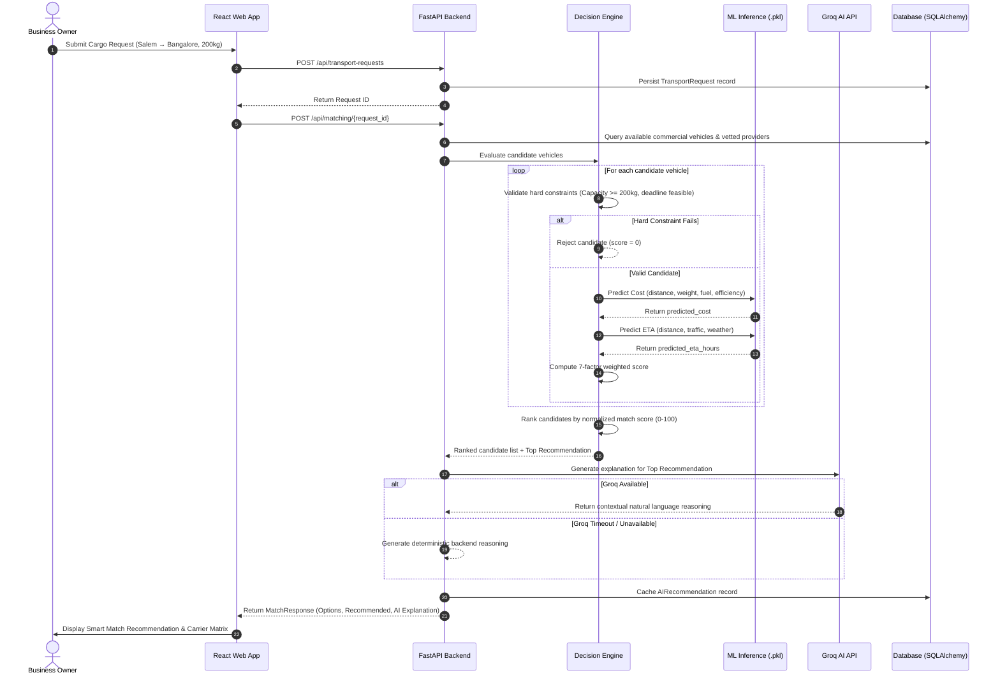

# DRIVA Architecture Specification
**Dynamic Routing, Intelligence & Vehicle Allocation**

---

## 1. Architectural Philosophy

DRIVA is structured as a **Modular Monolith** designed for high developer velocity, clear separation of concerns, and seamless cloud deployment (Render, Railway, Supabase, Vercel).

The system avoids over-engineered distributed microservices for the hackathon MVP while enforcing strict architectural boundaries between:
- **Presentation & Client Tier** (React + TypeScript + Tailwind CSS)
- **API & Orchestration Tier** (FastAPI)
- **Intelligence & Decision Engine Tier** (Deterministic constraints + ML inference + Groq AI reasoning)
- **Persistence Tier** (SQLAlchemy + PostgreSQL / SQLite)

---

## 2. Component Diagram

```mermaid
graph TD
    subgraph Frontend [Presentation Layer - React 19]
        LP[Landing & Marketing]
        AuthUI[JWT Session & RBAC Gate]
        Wizard[Transport Request Multi-Step Form]
        MatchUI[Smart Match Comparison Matrix]
        TrackUI[Leaflet OpenStreetMap Tracking]
        AdminUI[Admin GMV & Revenue Dashboard]
        AIChat[Groq AI Assistant Drawer]
    end

    subgraph API [Application Layer - FastAPI]
        R_Auth[/api/auth]
        R_Trans[/api/transport-requests]
        R_Match[/api/matching]
        R_Book[/api/bookings]
        R_Veh[/api/vehicles]
        R_AI[/api/ai]
        R_Anal[/api/analytics]
    end

    subgraph DecisionEngine [Decision & Intelligence Core]
        HardFilter[Constraint Validator]
        WeightCalc[7-Factor Weighted Scorer]
        Ranker[Priority Sorter & Normalizer]
    end

    subgraph ML [Machine Learning Inference]
        CostModel[GradientBoosting Cost Model]
        ETAModel[GradientBoosting ETA Model]
        SuitModel[RandomForest Suitability Model]
        MLFallback[Deterministic Formula Fallback]
    end

    subgraph AI [LLM Reasoning Layer]
        GroqClient[Groq LLaMA 3.3 70B Client]
        AIFallback[Deterministic Explainer Engine]
    end

    subgraph DB [Data Layer]
        SQL[(PostgreSQL / SQLite Database)]
        ModelsPKL[(Serialized Model Binaries .pkl)]
    end

    Frontend --> API
    R_Match --> HardFilter
    HardFilter --> ML
    ML --> ModelsPKL
    ML -.-> MLFallback
    HardFilter --> WeightCalc
    WeightCalc --> Ranker
    Ranker --> DB
    R_Match --> AI
    AI --> GroqClient
    AI -.-> AIFallback
    API --> DB
```

---

## 3. Data Flow: Request to Allocation



---

## 4. 7-Factor Decision Engine Breakdown

The DRIVA Decision Engine evaluates candidate carriers against 7 normalized dimensions:

| Factor | Weight | Evaluation Rationale |
| :--- | :---: | :--- |
| **Route Compatibility** | **25%** | Proximity to origin freight hub and route corridor experience |
| **Freight Cost** | **20%** | Cost competitiveness relative to corridor median |
| **Delivery Time (ETA)** | **20%** | Delivery buffer before required deadline |
| **Capacity Suitability** | **15%** | Optimal utilization without overloading or excessive empty payload |
| **Vehicle Class Suitability** | **10%** | Vehicle age, fuel efficiency rating, and cargo compartment compatibility |
| **Provider Reliability** | **5%** | Historical on-time delivery record and customer ratings |
| **Carrier Availability** | **5%** | Immediate dispatch readiness vs required positioning time |
| **TOTAL** | **100%** | **Normalized Score (0 – 100)** |

### Hard Constraint Gates (Pre-scoring filter)
Before scoring, candidates are strictly rejected if:
1. `vehicle.capacity_kg < cargo_weight_kg` (Strict overload prevention).
2. `vehicle.status != 'AVAILABLE'` (Unavailable assets excluded).
3. `predicted_eta_hours > deadline_hours` (Impossible deadline violation).

---

## 5. Security Architecture
- **JWT Bearer Authentication**: 8-hour access token expiration with secure HS256 signing.
- **Role-Based Access Control (RBAC)**: Fine-grained endpoints restricted to `BUSINESS_OWNER`, `FLEET_OWNER`, `LOGISTICS_AGENCY`, `DRIVER`, or `ADMIN`.
- **Zero Secret Exposure**: Frontend never accesses private API keys. `GROQ_API_KEY` and database credentials remain strictly backend-side.
- **SQL Injection Prevention**: 100% parameterized queries via SQLAlchemy ORM.
